# 🌟 Atmadeepum Society – NGO Management System

> **“Be a lamp unto yourself” (attadīpa)**
> *Illuminating Lives · Restoring Vision*

---

## 📌 Overview

Atmadeepum Society is a **full-stack NGO Management System** designed to support visually impaired individuals by managing donations, campaigns, and community services.

This platform enables:

* 💰 Transparent donation tracking
* 📦 Item donation & pickup scheduling
* 🧑‍💼 Admin verification system
* 📊 Real-time donor leaderboard
* 📬 Contact & support management

---

## 🚀 Features

### 👤 User Side

* 🏠 Modern NGO landing page
* ❤️ Donate money with UPI Transaction ID
* 📦 Donate items (Drop-off / Pickup)
* 🔍 View ongoing & completed campaigns
* 🏆 Top donors leaderboard
* 📬 Contact form

### 🛠️ Admin Dashboard

* 🔐 Secure access (password protected)
* ✅ Approve pending donations
* 📊 Manage campaigns (Add / Delete / Update)
* 📦 Track drop-off requests
* 🚚 Manage porter (pickup) services
* 📩 Handle contact queries

---

## 🧠 Tech Stack

### 💻 Frontend

* React.js
* HTML5, CSS3
* Axios

### ⚙️ Backend

* Node.js
* Express.js

### 🗄️ Database

* MongoDB (Local)

---

## 📂 Project Structure

```
📁 project-root
Project/
|--📁client/ (frontend)
|	├───public
|	|	|-- logo.png
|	|	|-- index.html
|	|	|-- manifest.json
|	|	|-- robots.txt
|	└───src/
|   |	|	├───components/
|	|	|	|-- Navbar.js
|   |	|	└───pages/
|	|	|	|-- Admin.jsx
|	|	|	|-- Contact.jsx
|	|	|	|-- Donate.jsx
|	|	|	|-- Home.jsx
|	|	|	|-- Mission.jsx
|	|	|	|-- OurWork.jsx
|	|	|	|-- TopDonors.jsx
|	|	|-- App.js
|	|	|-- App.test.js
|	|	|-- index.css
|	|	|-- index.js
|	|	|-- logo.svg
|	|	|-- reportWebVitals.js
|	|	|-- setupTests.js
|	|	|-- styles.css
|	|-- package.json
|	|-- package-lock.json
|-- README.md
|--📁server/ (Backend)
|	├───models/
|	|	|-- Contact.js
|	|	|-- Donation.js
|	|	|-- ourwork.js
|	|	|-- Porterservice.js
|	└───routes/
|	|	|-- contactRoutes.js
|	|	|-- donationRoutes.js
|	|	|-- dropoffRoutes.js
|	|	|-- ourworkRoutes.js
|	|	|-- porterserviceRoutes.js
|	|	|-- topdonosRoutes.js
|	|-- package.json
|	|-- package-lock.json
|	|-- server.js
|--client_Start.bat
|--Server_Start.bat
```

---

## ⚙️ Installation & Setup

### 1️⃣ Clone Repository

```bash
git clone https://github.com/UttkarshKhanke/NGOCEPProject.git
cd NGOCEPProject
```

---

### 2️⃣ Backend Setup

```bash
cd server
npm install
node server.js  or run Server_Start.bat in main Directory
```

✅ Runs on: `http://localhost:5000`

---

### 3️⃣ Frontend Setup

```bash
cd client
npm install
npm start   or run Client_Start.bat in main Directory
```

✅ Runs on: `http://localhost:3000`

---

## 🧪 API Endpoints 

|                           Contact APIs                               |
| Method | Endpoint                     | Description                  |
| ------ | ---------------------------- | ---------------------------- |
| POST   | `/api/contact`               | Create contact message       |
| PUT    | `/api/contact/:id`           | Update contact status        |
| GET    | `/api/contact`               | Get all contact messages     |

|                           Drop-off APIs                              |
| Method | Endpoint                     | Description                  |
| ------ | ---------------------------- | ---------------------------- |
| POST   | `/api/dropoff`               | Create drop-off request      |
| GET    | `/api/dropoff`               | Get all drop-offs            |
| PUT    | `/api/dropoff/:id`           | Update drop-off status       |

|                           Our Work (Campaigns)                       |
| Method | Endpoint                     | Description                  |
| ------ | ---------------------------- | ---------------------------- |
| POST   | `/api/ourwork`               | Create campaign              |
| GET    | `/api/ourwork`               | Get all campaigns            |
| PUT    | `/api/ourwork/:id`           | Update campaign              |
| DELETE | `/api/ourwork/:id`           | Delete campaign              |

|                           Porter Service APIs                        |
| Method | Endpoint                     | Description                  |
| ------ | ---------------------------- | ---------------------------- |
| POST   | `/api/porterservice`         | Create porter request        |
| GET    | `/api/porterservice`         | Get all porter requests      |
| PUT    | `/api/porterservice/:id`     | Update porter request status |

|                           Top Donors                                 |
| Method | Endpoint                     | Description                  |
| ------ | ---------------------------- | ---------------------------- |
| GET    | `/api/topdonors`             | Get top 10 donors            |


---

## 🔐 Admin Access

```
Password: uk123
```

> ⚠️ This is for development only. Use authentication (JWT) in production.

---

## 📸 Screenshots

> Add screenshots here 

* Home Page
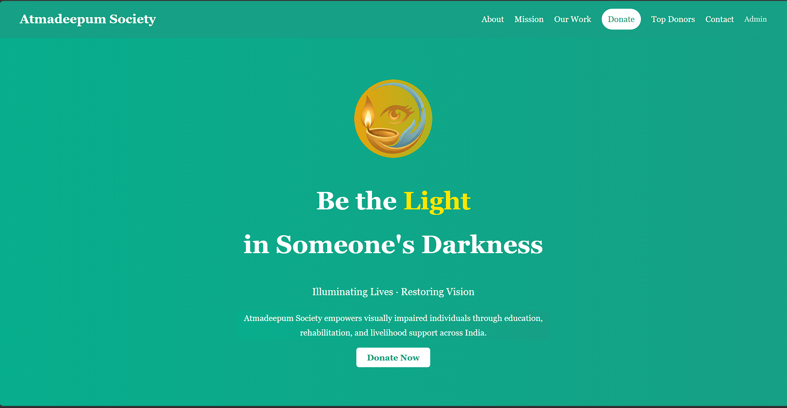
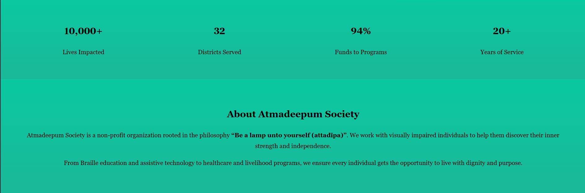
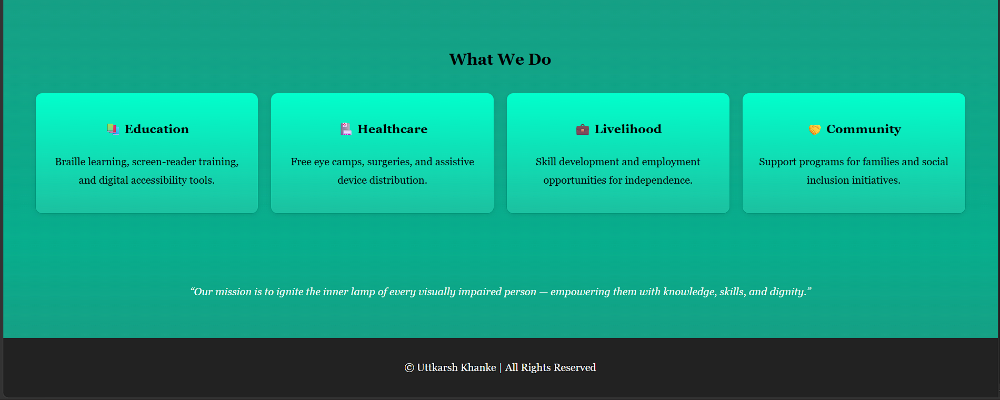

* Mission Page
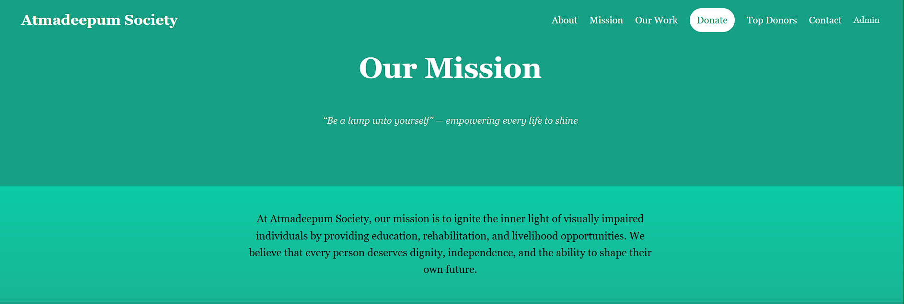
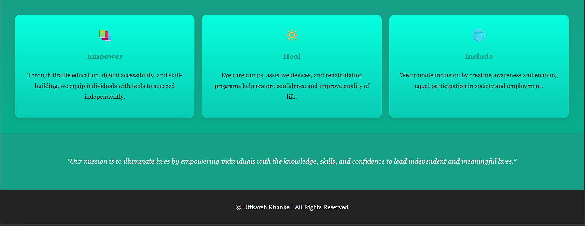

* OurWork Page
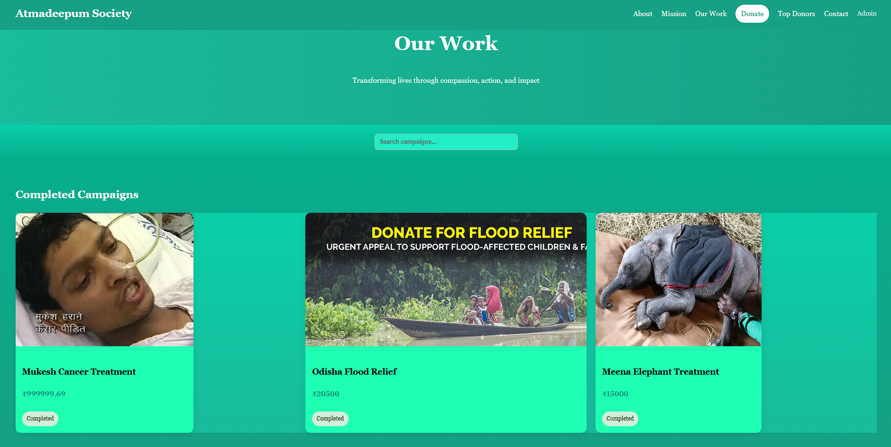
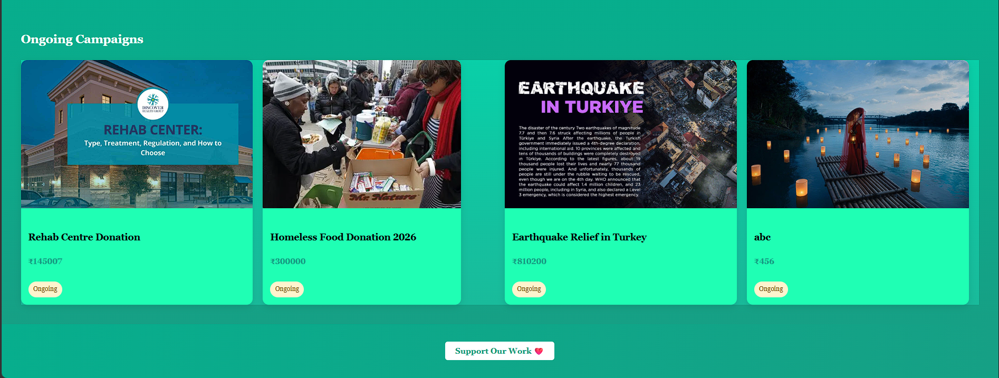

* Donate Page
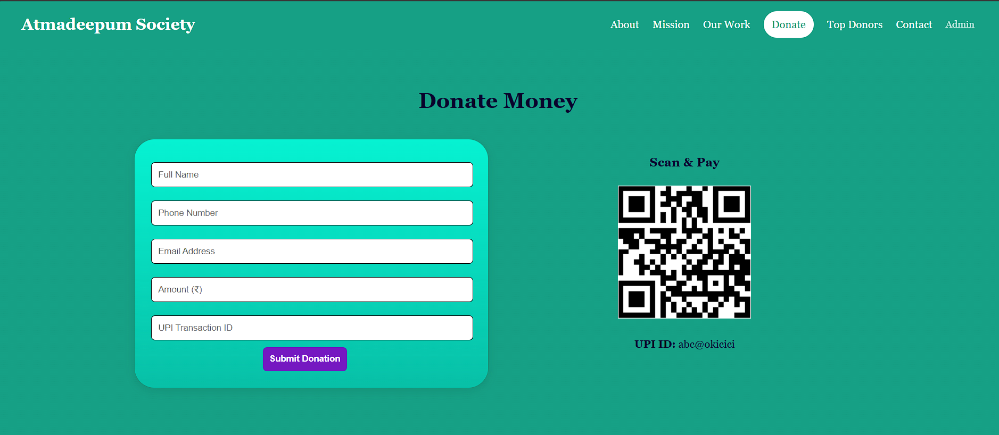
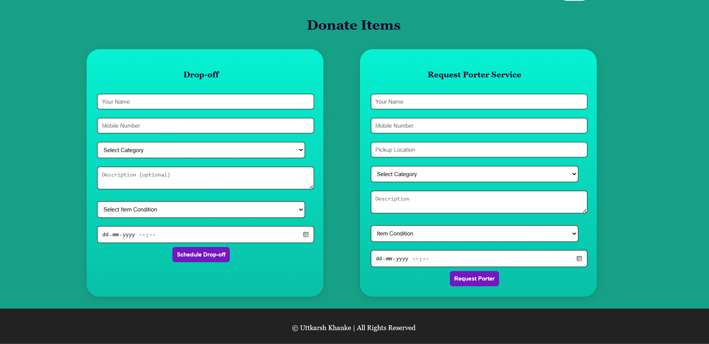

* Top Donors Page
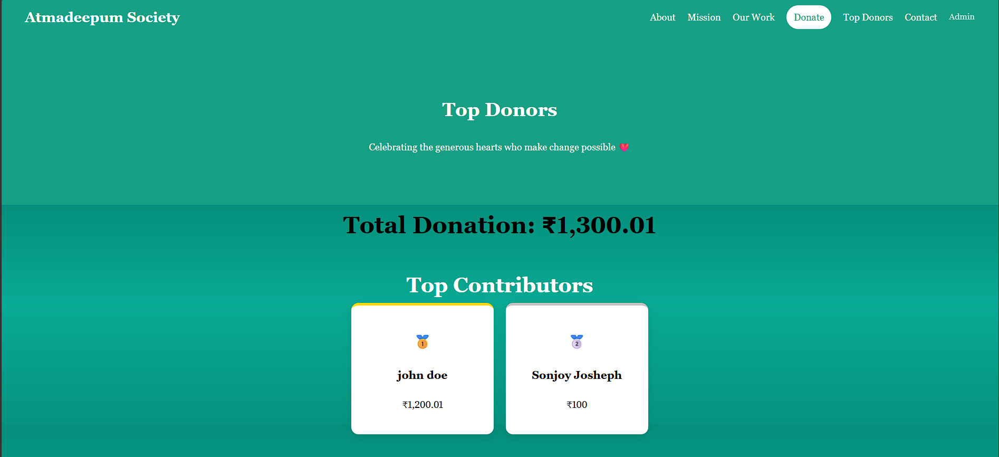


* Contact Us Page
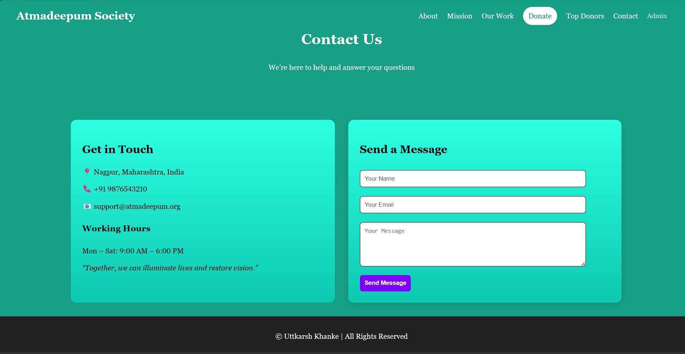

* Admin Dashboard
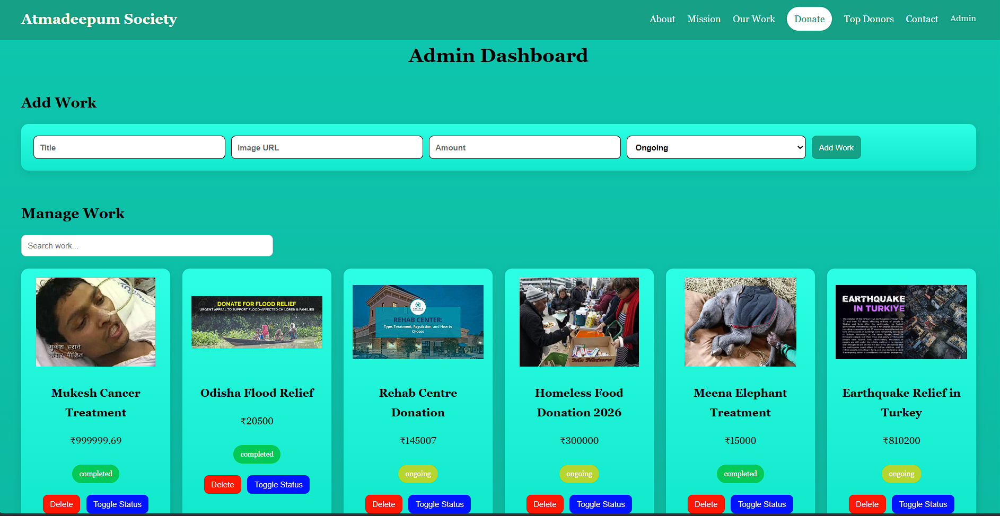
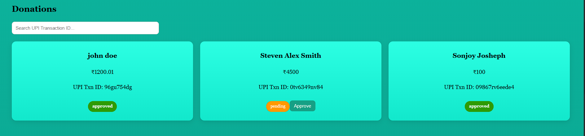
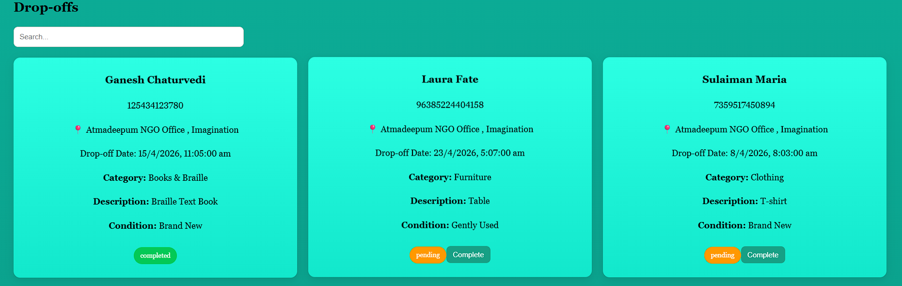
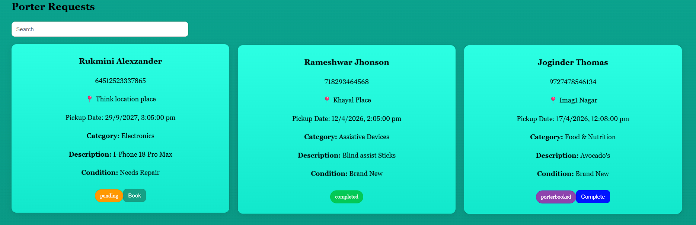
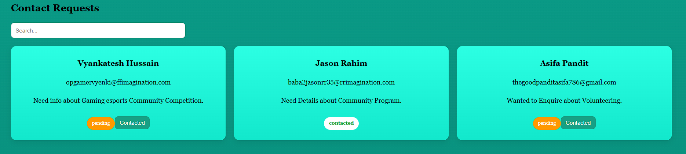


---

## 🎯 Future Enhancements

* 🔐 JWT Authentication
* 📊 Dashboard Analytics (Charts)
* ☁️ Cloud Deployment (MongoDB Atlas)
* 💳 Payment Gateway Integration
* 📱 Mobile Responsive Improvements

---

## 🤝 Contribution

Contributions are welcome!

```bash
Fork → Create Branch → Commit → Push → Pull Request
```

---

## 📜 License

This project is for educational and portfolio purposes.

---

## ❤️ Acknowledgement

Inspired by the mission to empower visually impaired individuals and create a more inclusive society.

---

## 👨‍💻 Author

**Uttkarsh Khanke**

* 💼 Aspiring Software Developer
* 🚀 Passionate about Full Stack Development
* 🎯 Focused on building impactful projects

---

⭐ If you like this project, give it a **star** on GitHub!
